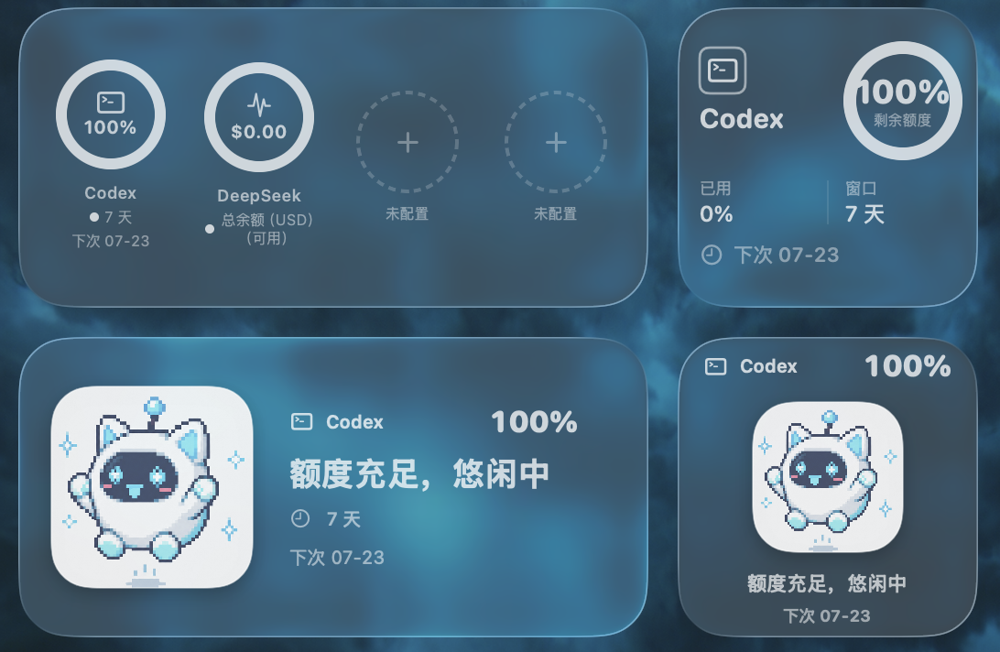

# TokenViewer

<p align="center">
  
</p>

<p align="center">
  原生 macOS 菜单栏应用与桌面小组件，一站式查看 AI 编程工具的额度使用情况。
</p>

> TokenViewer 直接读取本机日志或调用 API 查询额度，不上传日志、额度或账号信息。

## 功能

### 本地服务

- 自动发现本机已安装的 Claude Code 与 Codex（检测 `.claude` / `.codex` 数据目录、`/Applications/Claude.app` / `/Applications/Codex.app`、以及 Homebrew 或用户 bin 目录下的命令行工具）
- 读取 Codex 会话日志（`~/.codex/sessions/**/*.jsonl`）中的 `rate_limits` 字段，展示剩余百分比与重置时间
- 尝试读取 Claude Code 本地日志中的兼容额度字段，未提供时显示"不可用"（不会根据 token 消耗推算额度）
- 检测失败时支持在设置中手动导入数据目录路径

### API 配置

借鉴 [CC Switch](https://github.com/farion1231/cc-switch) 的设计，填入 API Key 即可拉取额度使用情况。

**预设模板：**

| 模板 | 说明 |
| --- | --- |
| 自定义 | 完全自定义 URL、Key、协议格式与额度接口路径 |
| 通用模板 | 适用于大多数 OpenAI 兼容中转服务 |
| NewAPI | 适配 NewAPI / One-API 风格的中转后台 |
| 自动识别 | 自动使用供应商的 API Key 查询账户余额（支持 DeepSeek、智谱 AI、MiniMax） |

- 自动识别模式必填官网链接，系统会按域名自动匹配对应厂商接口
- 自动识别出的供应商名称会显示在 UI 中
- 自定义、通用模板、NewAPI 展示提取器代码，便于对照供应商文档
- API Key 安全存储在系统 Keychain 中

**自动识别支持的厂商与字段说明：**

| 厂商 | 余额字段 | 说明 |
| --- | --- | --- |
| DeepSeek | `总余额（可用）` | `total_balance`，账户当前可用的总金额（包含赠送和充值） |
| DeepSeek | `赠送额度（免费）` | `granted_balance`，平台赠送的免费额度，不可提现，通常有有效期 |
| DeepSeek | `充值余额（付费）` | `topped_up_balance`，用户实际充值的金额 |
| 智谱 AI | `短周期（5小时窗口）` / `长周期（7天窗口）` | 按 `window_minutes` 自动识别窗口类型 |
| MiniMax | `总余额（可用）` | `balance`，账户当前可用总金额 |
| MiniMax | `赠送额度（免费）` | `credit_balance`，平台赠送额度 |
| MiniMax | `充值余额（付费）` | `cash_balance`，用户实际充值金额 |

> 多币种账户会按币种分别显示，如 `总余额（CNY）（可用）`、`总余额（USD）（可用）`。

### 界面与交互

- 在菜单栏显示所有可用额度中的最低剩余百分比
- 支持手动刷新，以及 1、5、15、30 或 60 分钟自动刷新
- 支持添加、移除、排序服务，并分别控制是否同步到小组件
- 提供可配置的 1×1、1×2 仪表盘小组件和额度宠物小组件
- 点击小组件可直接打开 TokenViewer
- 小组件编辑下拉框自动检测当前可用的服务和额度窗口
- 余额类字段在小组件中直接显示金额（如 `¥9.99`），进度类字段显示剩余百分比
- 下次刷新时间统一显示为"月-日"格式（如 `下次 07-23`），避免倒计时混淆

#### 桌面小组件预览

| 仪表盘小组件（1×1 / 1×2） | 额度宠物小组件 |
| :---: | :---: |
|  |  |

**额度宠物状态：**

| 额度充足 | 额度适中 | 额度紧张 |
| :---: | :---: | :---: |
|  |  |  |

## 系统要求

- macOS 14 Sonoma 或更高版本
- 本地服务：已在本机使用过 Claude Code 或 Codex，以便产生可读取的本地日志
- API 配置：已从供应商处获取 API Key 及相关信息
- 从源码构建完整 App 时需要 Xcode

## 安装

目前请从源码构建。克隆仓库后打开工程：

```bash
git clone https://github.com/Nova0313/TokenViewer.git
cd TokenViewer
open TokenViewer.xcodeproj
```

在 Xcode 中：

1. 为 `TokenViewer` 和 `TokenViewerWidget` 两个 Target 选择你自己的开发团队（`DEVELOPMENT_TEAM` 已在 `project.yml` 中留空，贡献者需自行设置）。
2. 确认两个 Target 使用同一个 App Group；默认配置为 `group.com.qianchen.tokenviewer.shared`。
3. 选择 `TokenViewer` Scheme，点击 Run。

> 语言 / Language: [简体中文](README.md) | [English](README_EN.md)

App 启动后只显示在菜单栏，不占用 Dock。

### 添加桌面小组件

1. 先启动 TokenViewer 并刷新一次额度。
2. 在桌面右键，选择"编辑小组件"。
3. 搜索 `TokenViewer`，选择需要的尺寸或额度宠物。
4. 右键已添加的小组件，可配置服务、额度周期和显示风格。

## 数据来源与限制

### 本地服务

TokenViewer 当前读取以下目录中的 JSONL 日志：

- Codex：`~/.codex/sessions/**/*.jsonl`
- Claude Code：`~/.claude/**/*.jsonl`

Codex 日志的 `rate_limits` 字段通常包含 `primary`（短期，5 小时窗口）和 `secondary`（长期，7 天窗口）两个额度窗口，TokenViewer 会读取 `used_percent` 计算剩余百分比，并按 `resets_at` 时间戳显示重置时间。Claude Code 并不总是在本地日志中保存订阅额度；没有兼容数据时，TokenViewer 会显示"不可用"，不会根据 token 消耗量推算额度。

读取结果取决于上游日志格式，Claude Code 或 Codex 更新后可能需要同步适配。移除服务绑定只会删除 TokenViewer 自己的本地配置，不会修改原应用或其日志。

### API 配置

API 配置支持 OpenAI 兼容格式和 Anthropic 原生格式。自定义、通用模板和 NewAPI 模板需要供应商返回符合提取器规范的响应结构。自动识别模式会根据官网链接域名自动匹配已知厂商（DeepSeek、智谱 AI、MiniMax）的余额查询接口，并按厂商规范解析响应字段。

## 本地开发

直接运行菜单栏版本：

```bash
swift run TokenViewer
```

构建不含 WidgetKit 扩展的独立菜单栏 App：

```bash
./scripts/build-app.sh
open dist/TokenViewer.app
```

运行测试：

```bash
swift test
```

项目使用 [XcodeGen](https://github.com/yonaskolb/XcodeGen) 管理 Xcode 工程。修改 `project.yml` 后可重新生成：

```bash
brew install xcodegen
./scripts/generate-xcode-project.sh
```

仓库已包含生成好的 `TokenViewer.xcodeproj`，仅构建项目时无需安装 XcodeGen。

## 隐私

额度解析完全在本机进行。TokenViewer 不需要登录 Claude 或 OpenAI 账号，也不会上传本地日志或账号信息。API Key 安全存储在系统 Keychain 中，桌面小组件所需的额度快照通过 App Group 在主应用与 WidgetKit 扩展之间共享。

## 参与贡献

欢迎提交 Issue 和 Pull Request。报告额度解析问题时，请勿上传包含提示词、账号信息或其他敏感内容的完整日志；建议只提供已脱敏的额度字段和日志结构。
