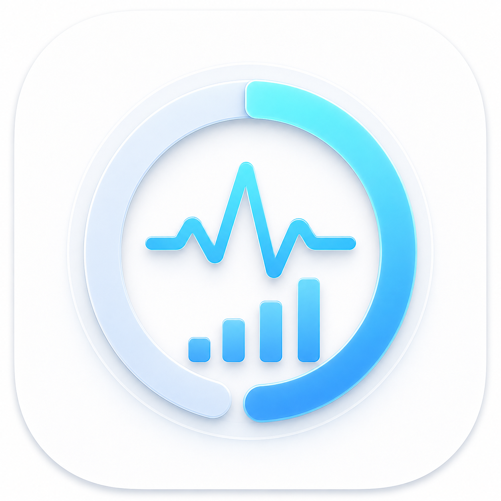

# TokenViewer

<p align="center">
  
</p>

<p align="center">
  Native macOS menu bar app and desktop widget to view local quotas for Claude Code and Codex.
</p>

> TokenViewer reads local logs directly. It does not upload logs, quotas, or account information.

> Language: [简体中文](README.md) | [English](README_EN.md)

## Features

- Displays Codex short-term (typically 5 hours) and long-term (typically 7 days) quotas, remaining percentage, and reset time
- Attempts to read compatible quota fields from Claude Code local logs
- Shows the lowest remaining percentage across all available quotas in the menu bar
- Supports manual refresh, as well as 1, 5, 15, 30, or 60 minute auto-refresh
- Auto-discovers locally installed Claude Code and Codex
- Add, remove, reorder services, and control whether each syncs to the widget
- Provides configurable 1×1, 1×2 dashboard widgets and a quota pet widget
- Click the widget to open TokenViewer directly

| High quota | Normal quota | Low quota |
| :---: | :---: | :---: |
|  |  |  |

## System Requirements

- macOS 14 Sonoma or later
- Claude Code or Codex must have been used locally at least once to generate readable local logs
- Building the full app from source requires Xcode

## Installation

Currently, please build from source. Clone the repository and open the project:

```bash
git clone https://github.com/Nova0313/TokenViewer.git
cd TokenViewer
open TokenViewer.xcodeproj
```

In Xcode:

1. Select your own development team for both the `TokenViewer` and `TokenViewerWidget` targets (`DEVELOPMENT_TEAM` is left empty in `project.yml`; contributors need to set it themselves).
2. Confirm both targets use the same App Group; the default is `group.com.tokenviewer.shared`.
3. Select the `TokenViewer` scheme and click Run.

After launch, the app appears only in the menu bar and does not occupy the Dock.

### Adding Desktop Widgets

1. First launch TokenViewer and refresh the quota once.
2. Right-click on the desktop and select "Edit Widgets".
3. Search for `TokenViewer` and choose the size or quota pet you need.
4. Right-click an added widget to configure service, quota period, and display style.

## Data Sources and Limitations

TokenViewer currently reads JSONL logs from the following directories:

- Codex: `~/.codex/sessions`
- Claude Code: `~/.claude`

Codex logs usually contain both short-term and long-term quota windows. Claude Code does not always store subscription quotas in local logs; when no compatible data is available, TokenViewer shows "Unavailable" and does not estimate quota from token consumption.

Results depend on the upstream log format. After Claude Code or Codex updates, TokenViewer may need to adapt accordingly. Removing a service binding only deletes TokenViewer's own local configuration and does not modify the original app or its logs.

## Local Development

Run the menu bar version directly:

```bash
swift run TokenViewer
```

Build a standalone menu bar app without the WidgetKit extension:

```bash
./scripts/build-app.sh
open dist/TokenViewer.app
```

Run tests:

```bash
swift test
```

The project uses [XcodeGen](https://github.com/yonaskolb/XcodeGen) to manage the Xcode project. After modifying `project.yml`, regenerate it with:

```bash
brew install xcodegen
./scripts/generate-xcode-project.sh
```

The repository already includes a pre-generated `TokenViewer.xcodeproj`; installing XcodeGen is only required when modifying the project.

## Privacy

Quota parsing is entirely local. TokenViewer does not require logging in to Claude or OpenAI accounts, and does not upload local logs or account information. The quota snapshots required by desktop widgets are shared between the main app and the WidgetKit extension via an App Group.

## Contributing

Issues and Pull Requests are welcome. When reporting quota parsing issues, please do not upload complete logs containing prompts, account information, or other sensitive content. Provide only the redacted quota fields and log structure.
